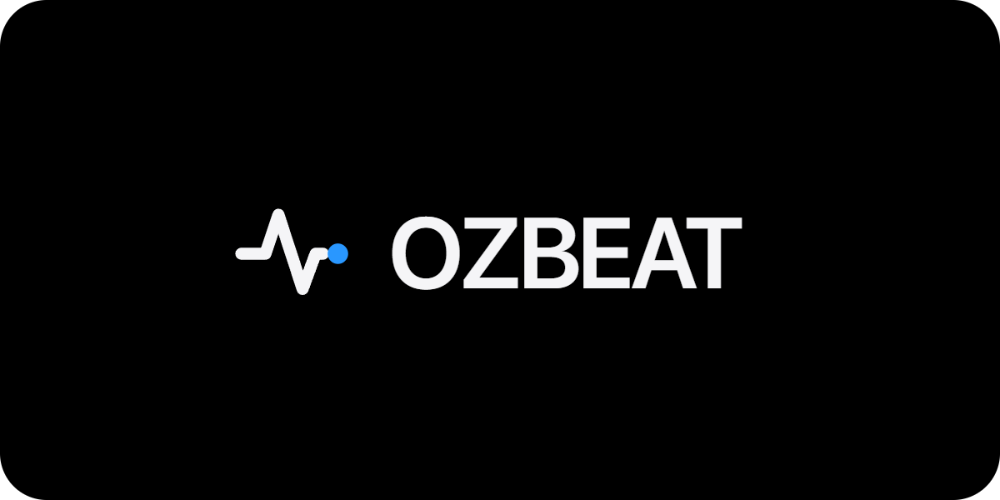
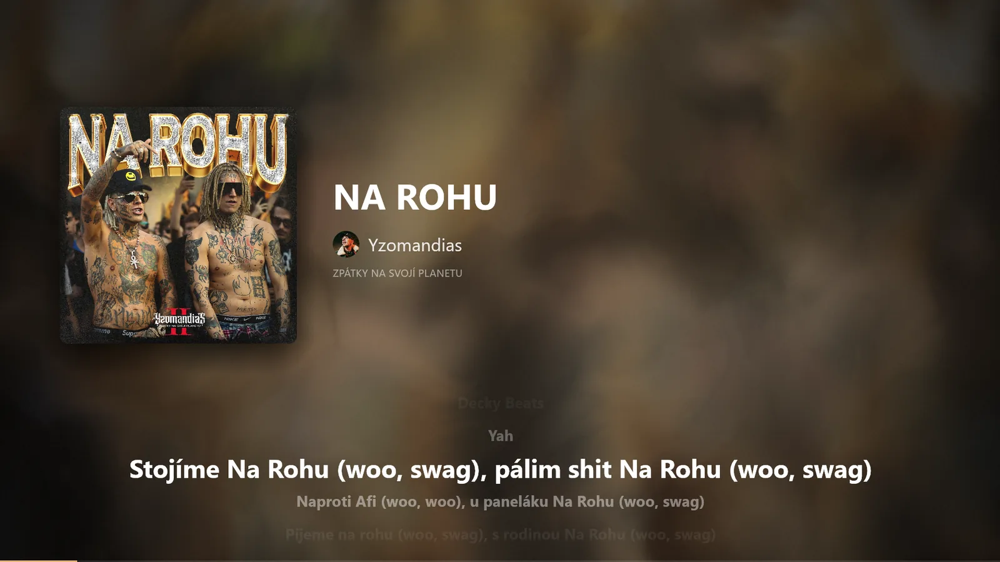
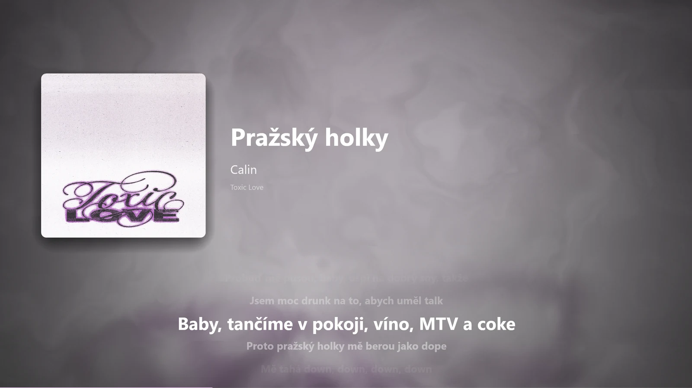

<p align="center"></p>

<p align="center">
  <b>A music visualizer for Windows.</b><br>
  Cover art, synced lyrics and smooth visuals for whatever is playing.
</p>

<p align="center">
  <a href="https://github.com/oondraa/OZBEAT/releases/latest/download/OZBEAT.exe"><b>⬇ Download OZBEAT.exe</b></a>
  &nbsp;·&nbsp;
  <a href="https://github.com/oondraa/OZBEAT/releases/latest/download/OZBEAT.scr">⬇ Screensaver (.scr)</a>
  &nbsp;·&nbsp;
  <a href="https://oondraa.github.io/OZBEAT/">Website</a>
  &nbsp;·&nbsp;
  <a href="#česky">Česky</a>
</p>

<p align="center">
  
  
</p>

## What it does

Play music the way you normally do. OZBEAT notices it and fills the screen with it:

- **Works with what you already use.** Spotify, YouTube in the browser, the Windows media player, and any app that shows up in the Windows volume / media controls. Also **BluOS** network speakers on your Wi-Fi.
- **Synced lyrics** that scroll along with the song, when the song has them.
- **Cover art and artist photos** as a soft, moving background.
- **Reacts to the music.** Visuals swell with the sound instead of flashing.
- **Two screens.** Cover on one, lyrics on the other.
- **Screensaver.** The same picture when your PC is idle.

## Get started

1. Download **[OZBEAT.exe](https://github.com/oondraa/OZBEAT/releases/latest/download/OZBEAT.exe)**.
2. Double-click it. You don't need to install anything.
3. On the first start, pick where your music plays (this PC and/or your speakers). You can change it any time with `Ctrl+S`.
4. Play a song.

> **"Windows protected your PC"?** The app is new and not code-signed yet, so SmartScreen doesn't know it. Click **More info → Run anyway**.

### Use it as a screensaver

1. Download **[OZBEAT.scr](https://github.com/oondraa/OZBEAT/releases/latest/download/OZBEAT.scr)**.
2. Right-click it and choose **Install**.
3. In the Windows screensaver window that opens, set **Wait** (how many minutes of idle time) and click **OK**.

The screensaver covers **all your monitors**, the same way as `Ctrl+D`: cover and title on the main screen, lyrics on the second. Move the mouse or press a key to close it. The small preview in the Windows dialog stays black. That's expected, and the real screensaver works.

Run `OZBEAT.exe` once before you use the screensaver, so your settings are ready.

### Keyboard

| Key | What it does |
|---|---|
| `F11` or double-click | Fullscreen on / off |
| `Ctrl+D` | Use a second screen: cover here, lyrics there |
| `Ctrl+S` | Settings |
| `Esc` | Leave fullscreen / close settings |

## Questions

**Nothing shows up.** Check that the music app shows its song in the Windows media controls (the box above the volume slider). If it doesn't show there, OZBEAT can't see it either. For BluOS speakers, the PC and the speaker must be on the same network.

**No lyrics for a song.** Lyrics come from a free public database, and not every song is in it. OZBEAT then shows the title and artist instead.

**Does it send my data anywhere?** It only looks up artwork and lyrics for the song that is playing, using public music databases. There are no accounts and no tracking.

<details>
<summary><b>Advanced: command-line options</b></summary>

```
OZBEAT.exe [OPTIONS]

--bluos <HOST>   Connect to a BluOS player at HOST (repeatable)
--no-discover    Don't search the network for BluOS players
--no-smtc        Don't read Windows media sessions
--youtube        Fetch background clips via your own yt-dlp (off by default)
--audio <MODE>   auto | loopback | mic | off
```

Optional environment variables: `FANART_API_KEY` and `THEAUDIODB_API_KEY` (more artwork), `MV_YTDLP` (path to `yt-dlp`).

Screensaver arguments (used by Windows): `/s` run, `/c` settings, `/p` preview.
</details>

<details>
<summary><b>Build from source</b></summary>

Needs a recent stable [Rust](https://rustup.rs) toolchain.

```
cargo build --release -p musicvisual
```

The exe ends up in `target/release/musicvisual.exe`. Copy or rename it to `OZBEAT.scr` to get the screensaver.
</details>

## License

OZBEAT is **free for personal, non-commercial use**. The source code is public so you can see how it works, but it is **not open source**. You may not:

- use it commercially, for example in a business, bar, club, event or paid stream;
- redistribute or re-upload it;
- reuse its code in other projects.

Contact the author for anything beyond personal use. Full terms are in [LICENSE](LICENSE). The open-source libraries it uses are listed in [THIRD_PARTY_LICENSES.md](THIRD_PARTY_LICENSES.md).

Copyright © 2026 Ondra (oondraa). All rights reserved.

---

## Česky

**OZBEAT** je vizualizér hudby pro Windows. Pusť si hudbu jako obvykle a OZBEAT ukáže obal alba, synchronizovaný text a plynulé animace, které reagují na hudbu.

**Jak začít**

1. Stáhni **[OZBEAT.exe](https://github.com/oondraa/OZBEAT/releases/latest/download/OZBEAT.exe)** a spusť ho. Nic se neinstaluje.
2. Při prvním spuštění vyber, kde hraje hudba (tento počítač nebo reproduktory BluOS).
3. Pusť písničku.

Když Windows ukáže hlášku **„Systém Windows ochránil váš počítač“**, klikni na **Další informace → Přesto spustit**. Aplikace zatím není digitálně podepsaná.

**Spořič obrazovky**

1. Stáhni **[OZBEAT.scr](https://github.com/oondraa/OZBEAT/releases/latest/download/OZBEAT.scr)**.
2. Klikni na něj pravým tlačítkem a dej **Instalovat**.
3. V okně spořiče nastav, po kolika minutách se má spustit, a dej **OK**.

Spořič zabere všechny monitory: na hlavním je obal a název, na druhém text. Ukončíš ho pohybem myši nebo klávesou.

**Klávesy:** `F11` nebo dvojklik přepíná celou obrazovku. `Ctrl+D` zapne druhý monitor. `Ctrl+S` otevře nastavení. `Esc` celou obrazovku nebo nastavení zavře.

**Licence:** zdarma jen pro osobní, nekomerční použití. Komerční použití, další šíření a převzetí kódu nejsou povolené. Podrobnosti najdeš v [LICENSE](LICENSE).
